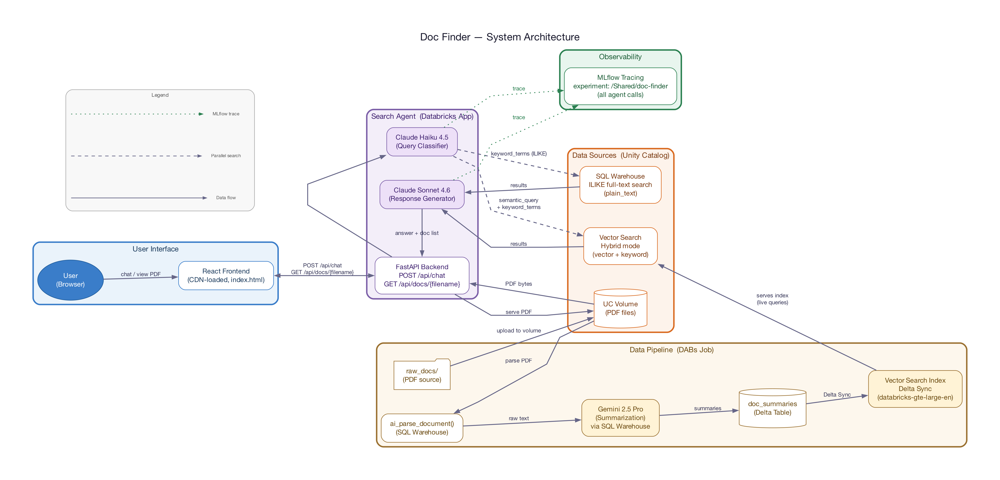

# Doc Finder

Internal document search app for Integra LifeSciences. Employees describe the document they need via a chat interface, an AI agent searches the corpus using **hybrid search** (semantic + exact keyword), and the best matching PDF is displayed in a side panel.

Deployed via **Databricks Asset Bundles (DABs)** for multi-environment portability.

## Architecture



- **Databricks App**: React frontend (CDN-loaded) + FastAPI backend, deployed as a single Databricks App
- **FastAPI Backend**: Orchestrates all calls — query classification, search dispatch, response generation, and PDF serving
- **Claude Haiku 4.5**: Query classifier — returns semantic query, keyword terms, and reasoning to FastAPI
- **Claude Sonnet 4.6**: Response generator — receives merged search results from FastAPI, returns answer + filename
- **Vector Search**: Databricks Vector Search in hybrid mode (vector + keyword) over summary embeddings (`databricks-gte-large-en`)
- **SQL Keyword Search**: Punctuation-normalized `ILIKE` on the `doc_summaries.plain_text` column via SQL Warehouse
- **Deployment**: Databricks Asset Bundles → Databricks App

### Hybrid Search

The search operates on four layers:

1. **Query understanding (Claude Haiku 4.5)** — classifies the user's query, rephrases it for better semantic matching, and extracts keyword terms for exact text search. Uses a fast, non-thinking model to minimize latency.
2. **Vector Search (hybrid mode)** — combines vector similarity + keyword matching within the VS index on document summaries, using the classifier's rephrased query
3. **SQL ILIKE** — punctuation-normalized text match on `plain_text` column (extracted content from text, table, title, and section header elements). Strips `: ; - space` from both the search term and document text so `45:28-33` matches `2006;45:28-33`.
4. **Response (Claude Sonnet 4.6)** — receives merged results from FastAPI along with the classifier's reasoning for context, prioritizes keyword matches for identifier queries, and explains why the document matches

| Query Type | Example | Search Path |
|-----------|---------|-------------|
| **Semantic** | "Find the wound healing brochure" | Haiku rephrases → VS hybrid on summaries |
| **Exact identifier** | "Find document K243531" | Haiku extracts terms → VS hybrid + SQL ILIKE |
| **Citation/partial** | "45:28-33" | Haiku extracts keyword terms → VS hybrid + normalized SQL ILIKE |

#### Why keyword search matters

Standard vector search encodes *meaning*, not literal strings. An FDA K-number like `K243531` or a citation like `45:28-33` has no semantic meaning to an embedding model — it's just noise. The keyword layer guarantees these exact matches surface even when vector search misses entirely.

#### Punctuation normalization

Medical documents contain identifiers with inconsistent formatting — colons, semicolons, hyphens, and spaces vary between documents. The keyword search strips `: ; - space` from **both** the search term and the stored document text before comparing:

| User types | Stored in document | Normalized | Match? |
|---|---|---|---|
| `45:28-33` | `2006;45:28-33` | `452833` / `2006452833` | Yes |
| `K243531` | `K243531` | `k243531` / `k243531` | Yes |
| `510(k)` | `510 (k)` | `510(k)` / `510(k)` | Yes |

The SQL applies this normalization inline:
```sql
REPLACE(REPLACE(REPLACE(REPLACE(LOWER(plain_text), ':', ''), ';', ''), '-', ''), ' ', '')
LIKE '%452833%'
```

#### What `plain_text` contains

The pipeline extracts only **text, table, title, and section header** elements from parsed PDF content. This gives clean searchable text without layout noise, so identifiers embedded in tables or headings are still findable.

### Data Flow

```
User describes document in chat
  → React Frontend sends POST /api/chat to FastAPI
  → FastAPI calls Claude Haiku 4.5 → returns {semantic_query, keyword_terms, reasoning}
  → FastAPI dispatches searches in parallel:
      • Vector Search hybrid query on doc_summaries.summary (always)
      • SQL ILIKE on doc_summaries.plain_text (if keyword_terms extracted)
  → FastAPI merges and deduplicates results by filename
  → FastAPI sends combined results + reasoning + user message to Claude Sonnet 4.6
  → Sonnet returns explanation + {filename, score} to FastAPI
  → FastAPI returns response to Frontend
  → Frontend renders response in chat + loads PDF via GET /api/docs/{filename}
  → FastAPI fetches PDF from Unity Catalog volume and returns it
```

### Data Pipeline

```
data_pipeline (DABs job, on Databricks):
  → Step 0: Create UC schema + volume, upload PDFs from raw_docs/ (skips existing)
             Set skip_upload variable to "true" if you land PDFs via your own pipeline
  → Step 1: ai_parse_document extracts text from each PDF
  → Step 2: ai_query (Gemini 2.5 Pro, 100K char input) generates ~200-word summary per document;
           plain_text extracted from content elements (text, table, title, section_header)
  → Step 3: Vector Search Delta Sync index embeds summaries with databricks-gte-large-en
  → Output: doc_summaries table (filename, summary, full_text, plain_text) + VS index
```

## Project Structure

```
doc_finder/
├── databricks.yml               # DABs bundle config (variables + targets)
├── resources/
│   ├── doc_finder_app.yml       # App resource (+ SQL warehouse for keyword search)
│   └── pipeline_jobs.yml        # Data pipeline job (4 sequential tasks)
├── src/
│   ├── app/                     # App source (deployed to Databricks)
│   │   ├── app.yaml             # Databricks App runtime config
│   │   ├── requirements.txt     # Python dependencies
│   │   ├── backend/
│   │   │   ├── main.py          # FastAPI app (chat + PDF endpoints)
│   │   │   ├── agent.py         # Hybrid search agent (Haiku classifier + Claude response)
│   │   │   ├── vector_search.py # Vector Search query client
│   │   │   └── keyword_search.py# SQL ILIKE search on plain text
│   │   └── static/
│   │       └── index.html       # React frontend (CDN-loaded)
│   └── pipeline/                # Pipeline scripts (run as DABs job tasks)
│       ├── _config.py           # Shared config parser (CLI args + env vars)
│       ├── 00_upload_docs.py    # Create schema/volume + upload PDFs
│       ├── 01_parse_docs.py     # Parse PDFs with ai_parse_document
│       ├── 02_summarize_docs.py # Summarize with Gemini 2.5 Pro (100K input)
│       ├── 03_create_vs_index.py# Create VS endpoint + index
│       └── 04_grant_app_permissions.py
├── scripts/
│   └── configure.py             # Generate app.yaml (stamps MLFLOW_APP_NAME from git branch)
├── .env.example                 # Template for local pipeline runs
└── raw_docs/                    # Source PDFs
```

## Bundle Variables

All environment-specific values are defined as variables in `databricks.yml`:

| Variable | Description | Default |
|----------|-------------|---------|
| `catalog` | Unity Catalog catalog | `morgan_stable_classic_6df0yw_catalog` |
| `schema` | Unity Catalog schema | `doc_finder` |
| `warehouse_id` | SQL Warehouse ID (pipeline + keyword search) | `718f1b203cdea5c4` |
| `vs_endpoint_name` | Vector Search endpoint | `doc_finder_vs_endpoint` |
| `vs_index_name` | Vector Search index (full name) | `<catalog>.<schema>.doc_summaries_index` |
| `foundation_model` | LLM for chat agent | `databricks-claude-sonnet-4-6` |
| `embedding_model` | Embedding model for VS | `databricks-gte-large-en` |
| `volume_name` | Volume for PDF storage | `raw_docs` |
| `skip_upload` | Skip PDF upload step (use your own pipeline) | `false` |

Three targets are pre-configured in `databricks.yml`:

| Target | Workspace | Purpose |
|--------|-----------|---------|
| `Databricks_Dev` | FEVM (Morgan) | Internal dev/test |
| `Databricks_Demo` | e2-demo-field-eng | Client-facing demo |
| `Integra_Dev` | *Client workspace* | Client's own dev environment — update placeholder values |

To add a new target, copy the `Integra_Dev` block and fill in your workspace details.

## Setup

### Prerequisites

- Databricks CLI v0.239.0+ (`databricks --version`)
- Authenticated CLI profile for the target workspace
- Python 3.11+ with: `databricks-sdk`, `databricks-sql-connector`, `databricks-vectorsearch`, `openai`

### 1. Configure for your target

```bash
python scripts/configure.py Databricks_Demo
```

This writes `DATABRICKS_APP_NAME` (`doc-finder-<target>`, must match the bundle app name) and `MLFLOW_APP_NAME` (`doc-finder-<sanitized-git-branch>` for MLflow version labels). Run from a git checkout so the branch is detected; without git, `MLFLOW_APP_NAME` falls back to `doc-finder-<target>`.

### 2. Deploy everything via DABs

```bash
databricks bundle deploy -t Databricks_Demo
databricks bundle run data_pipeline -t Databricks_Demo   # Upload → Parse → Summarize → Index
databricks bundle run doc_finder -t Databricks_Demo      # Start app
```

### 3. Grant permissions

```bash
APP_SP_ID=$(databricks apps get doc-finder-Databricks_Demo --output=json \
  | python3 -c "import sys,json; print(json.load(sys.stdin)['service_principal_client_id'])")

python src/pipeline/04_grant_app_permissions.py \
  --catalog=morgancatalog \
  --schema=doc_finder \
  --warehouse-id=4b9b953939869799 \
  --app-sp-id=$APP_SP_ID
```

Grants: USE_CATALOG, USE_SCHEMA, SELECT on VS index, SELECT on doc_summaries table, READ_VOLUME.

## Deploying to a New Workspace

1. Add a new target in `databricks.yml` with the workspace profile and variable overrides
2. `python scripts/configure.py <target>` to generate `src/app/app.yaml`
3. `databricks bundle deploy -t <target>`
4. `databricks bundle run data_pipeline -t <target>`
5. `databricks bundle run doc_finder -t <target>`
6. Grant permissions to the new app's service principal

## Adding New Documents

1. Upload new PDFs to the volume
2. Re-run the pipeline:
   ```bash
   databricks bundle run data_pipeline -t Databricks_Demo
   ```
   This re-parses all PDFs, regenerates summaries, and syncs the VS index.

## Observability

All agent interactions are traced via **MLflow** to the `/Shared/doc-finder` experiment. Each request produces a trace with spans for:

- **chat** (AGENT) — top-level span with user message, response, and extracted filename
- **classify_query** (CHAIN) — Claude Haiku 4.5 classification: semantic_query, keyword_terms, reasoning
- **vector_search** (RETRIEVER) — Vector Search results with scores
- **keyword_search** (RETRIEVER) — SQL ILIKE results (if keyword terms were extracted)
- **OpenAI calls** (auto-traced) — raw LLM request/response for both Haiku and Claude Sonnet

Users can give thumbs up/down on each response with an optional comment. Feedback is stored as `feedback.thumbs_up` and `feedback.comment` tags on the MLflow trace.

- **Session** — frontend generates a UUID per browser tab, set via `mlflow.trace.session` metadata. Groups multi-turn conversations.
- **Version** — set via MLflow LoggedModel on app startup. Automatically derived from the Databricks App deployment ID (no manual step needed).

View traces in the Databricks workspace under **Experiments → /Shared/doc-finder**.

## Databricks Resources Used

| Resource | Used By | Purpose |
|----------|---------|---------|
| **SQL Warehouse** | Pipeline + App (keyword search) | `ai_parse_document`, `ai_query`, `ILIKE` on plain text |
| **Vector Search Endpoint** | App (semantic search) | Similarity search over document summaries |
| **Foundation Model API** | App | Claude Haiku 4.5 (query classification), Claude Sonnet 4.6 (chat agent) |
| **Foundation Model API** | Pipeline | Gemini 2.5 Pro (document summarization via `ai_query`) |
| **Unity Catalog Volume** | Pipeline + App | PDF storage and serving |
| **MLflow Experiment** | App | Trace storage for all agent interactions (`/Shared/doc-finder`) |
| **Databricks App** | End users | FastAPI + React frontend |
